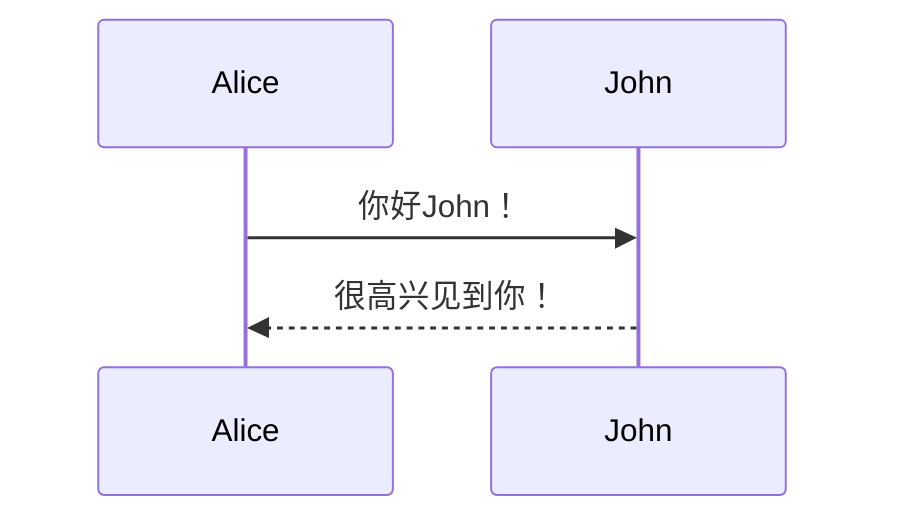
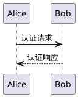

# Slidev 演示文稿创建器

使用Slidev框架创建精美、对开发者友好的演示文稿。这个技能帮助你生成具有markdown语法、交互功能和专业布局的精美幻灯片。

## 快速开始

```bash
# 创建新的演示文稿
/slidev create "我的精彩演示"

# 使用指定主题创建
/slidev create "技术演讲" --theme "seriph"

# 从模板创建
/slidev create "产品演示" --template "company"
```

## 使用说明

当用户要求创建演示文稿、幻灯片或演讲时，必须创建**极致丰富的图文并茂内容**：

### 🎨 **核心要求 - 每页必备元素**

**📊 视觉元素要求：**
- 每页至少包含2-3个专业图标（carbon图标库）
- 使用渐变色彩和卡片式布局
- 包含数据可视化（进度条、图表、流程图）
- 添加背景装饰和视觉层次

**⚡ 内容丰富性要求：**
- 每页文字内容充实，包含详细信息
- 使用网格布局展示多个相关要点
- 添加代码示例、图表、统计数据
- 包含实际案例和具体数据

**🎪 交互功能要求：**
- 使用v-click实现渐进式内容展示
- 添加悬浮效果和过渡动画
- 包含可点击交互元素
- 代码高亮和实时演示效果

### 🚀 **执行流程**

1. **深度需求分析**：理解用户具体场景和目标受众
2. **内容架构设计**：规划丰富内容结构和信息层次
3. **视觉风格定制**：选择合适主题并设计专业视觉效果
4. **丰富内容创作**：创建详实的文字内容和数据支撑
5. **交互功能集成**：添加动画、图表和交互元素
6. **质量标准验证**：确保每页都达到商业级视觉标准

### 📋 **强制执行标准**

**禁止行为：**
- ❌ 不允许出现纯文字页面
- ❌ 不允许内容过于简单空洞
- ❌ 不缺乏视觉元素和交互效果
- ❌ 不使用单一单调的布局

**必须执行：**
- ✅ 每页必须包含丰富的视觉元素
- ✅ 每页必须内容充实、信息量大
- ✅ 必须使用现代化的卡片式设计
- ✅ 必须包含数据可视化和图表
- ✅ 必须添加交互动画效果

## 基本前置元数据

```yaml
---
title: "演示文稿标题"
theme: "seriph"  # 或 default, apple-basic, bricks, shades-of-purple, minami, meetup, dev
author: "你的名字"
date: "2024-01-01"
highlighter: "shiki"  # 或 prism
lineNumbers: true
download: "PDF"  # 可选的下载按钮
---
```

## 热门主题

- **seriph** - 专业衬线字体，适用于商务/技术演示
- **default** - 简洁极简，适用于通用场景
- **apple-basic** - Apple风格设计，适用于产品演示
- **dev** - 面向开发者，具有终端美学
- **shades-of-purple** - 紫色调深色主题
- **bricks** - 创意乐高积木主题，适用于创意内容

## 常用布局

### 双栏布局
```markdown
---
layout: two-cols
---

# 标题

::left::

左栏内容

::right::

右栏内容
```

### 居中内容
```markdown
---
layout: center
---

# 居中标题

完美适用于引用或关键点
```

### 图片焦点
```markdown
---
layout: image
---

# 图片幻灯片


图片描述
```

## 交互功能

### 代码高亮
```markdown
```js {1|2-4|all}
function greet(name) {
  return `Hello, ${name}!`
}
```
```

### 可点击元素
```markdown
<span @click="$slidev.nav.next" class="cursor-pointer">
  点击继续 <carbon:arrow-right />
</span>

<div v-click>点击显示的内容</div>
```

### 演讲者备注
```markdown
---

# 公开幻灯片内容

<!-- 仅对演示者可见的演讲者备注 -->
备注：在此详细解释概念并提供示例
```

## 图表和图表

### Mermaid图表
```markdown

```

### PlantUML图表
```markdown

```

## 图标和视觉元素

```markdown
<!-- 使用图标包 -->
<carbon:rocket class="text-4xl" />
<logos:vue class="text-2xl" />
<mdi:lightbulb class="text-xl" />
```

## 导出选项

### PDF导出
```bash
slidev export --format pdf
```

### PPTX导出
```bash
slidev export --format pptx
```

### PNG图片
```bash
slidev export --format png --with-clicks
```

### 静态站点
```bash
slidev build
```

## 模板

详细模板和示例，请查看：
- **examples/** - 完整演示文稿示例
- **templates/** - 即用型演示文稿模板

## 最佳实践

### 🎨 **图文并茂设计标准**

**每页必须包含的丰富元素：**
1. **视觉图标** - 至少3个专业carbon图标，增强视觉表达
2. **渐变背景** - 使用双色或三色渐变，营造专业视觉效果
3. **卡片布局** - 采用现代化卡片设计，层次分明
4. **数据可视化** - 进度条、统计图表、流程图等
5. **交互元素** - v-click渐进展示、悬浮效果、点击交互

**内容丰富性要求：**
1. **文字内容充实** - 每页包含200-500字的详细信息
2. **多维度展示** - 从不同角度说明同一主题
3. **实例支撑** - 包含具体案例、数据、统计信息
4. **深度分析** - 不仅展示表面信息，还要有深度见解
5. **实用价值** - 提供可执行的建议和解决方案

**专业技术演示要求：**
1. **代码高亮** - 使用语法高亮和逐行展示
2. **架构图表** - 使用Mermaid流程图展示技术架构
3. **性能数据** - 包含具体的性能指标和对比数据
4. **实际案例** - 展示真实的项目案例和实施效果
5. **最佳实践** - 提供行业标准和最佳实践建议

**商务演示要求：**
1. **财务数据** - 包含具体的营收、增长、市场份额数据
2. **对比图表** - 展示竞品对比、趋势分析
3. **用户反馈** - 真实的用户评价和满意度数据
4. **市场分析** - 详细的市场趋势和机会分析
5. **行动计划** - 具体的实施步骤和时间安排

### 📊 **视觉设计规范**

**色彩运用：**
- 主色调：品牌色或主题色，保持一致性
- 辅助色：2-3个协调的辅助色
- 渐变色：至少使用2个颜色的渐变效果
- 对比色：确保文字和背景有足够对比度

**布局原则：**
- 网格系统：使用CSS Grid或Flexbox创建有序布局
- 层次结构：标题、副标题、正文层次分明
- 留白：合理使用留白，避免拥挤
- 对齐：保持元素对齐，视觉整洁

**动画效果：**
- 进入动画：v-click实现渐进式展示
- 悬浮效果：hover状态下的视觉反馈
- 过渡动画：页面切换的平滑过渡
- 强调动画：重要元素的突出显示

### 🚀 **质量检查清单**

**每页必须检查：**
- [ ] 是否包含至少3个图标
- [ ] 是否使用渐变色彩
- [ ] 是否包含数据可视化
- [ ] 内容是否充实（200+字）
- [ ] 是否有交互元素
- [ ] 布局是否现代化且美观
- [ ] 是否包含具体案例或数据
- [ ] 视觉层次是否清晰
- [ ] 是否避免纯文字页面
- [ ] 整体效果是否达到商业级标准

## 要求

- Node.js 16+ 用于本地Slidev开发
- 可选：全局安装Slidev (`npm i -g @slidev/cli`)

## 高级使用

对于自定义Vue组件、复杂布局和集成，请查看详细的高级功能文档。

## 示例

查看examples/目录中的完整演示文稿示例：
- 带代码示例的技术演示
- 带图表和指标的业务演示
- 带渐进式展示的教程

**准备好创建你的演示文稿了吗？使用 `/slidev create` 开始吧！**