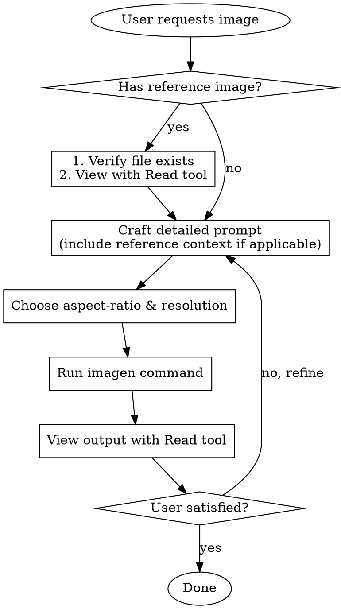

# Creating Images with imagen CLI

## Overview

`imagen` generates images from text prompts, optionally using reference images. Always verify inputs exist, view references before prompting, and check outputs after generation.

## Quick Reference

```
imagen [PROMPT] [OPTIONS]

Options:
  -m, --model <MODEL>         Model preset (mini, default, max) [default: default]
  -o, --output <OUTPUT>       Output path [default: ./imagen_[timestamp].png]
  -i, --input <INPUT>         Reference file (txt/md for details, image for reference)
  -a, --aspect-ratio <RATIO>  e.g. 1:1, 16:9, 9:16
  -r, --resolution <RES>      1K (fast), 2K (default), 4K (slow, high quality)
      --image-only            Return only image, no text
      --verbose               Show API details
```

## Workflow



## Prompt Structure

**Write prompts in consistent order:**
1. **Background/Scene** - environment, setting, context
2. **Subject** - main element, character, object
3. **Key Details** - materials, textures, colors, style
4. **Constraints** - what to preserve, what to exclude

**Include intended use** (ad, UI mock, infographic) to set polish level.

```bash
# ❌ Vague
imagen "a cat"

# ✅ Structured: scene → subject → details → style
imagen "Victorian windowsill with lace curtains, a fluffy orange cat sitting alertly, golden hour sunlight streaming through, bokeh garden background, professional photography, sharp focus on eyes, warm palette"
```

## Style-Specific Patterns

**Photorealism:** Use camera/lens terms instead of generic "8K/ultra-detailed":
```bash
# ❌ Generic quality words
imagen "ultra realistic detailed 8K photo of sailor"

# ✅ Photography language
imagen "candid photograph of elderly sailor on fishing boat, weathered skin with visible pores and wrinkles, shot on 35mm film, 50mm lens, shallow depth of field, soft coastal daylight, subtle film grain, natural color balance, no retouching"
```

**UI Mockups:** Describe as if product already exists:
```bash
imagen "mobile app UI for farmers market: header, vendor list with photos, Today's specials section, location/hours. White background, subtle accent colors, clear typography. Place in iPhone frame"
```

**Logo Generation:** Focus on scalability and simplicity:
```bash
imagen "original logo for Field & Flour bakery, warm and timeless, clean vector-like shapes, strong silhouette, balanced negative space, flat design, no gradients, plain background, centered with padding, no watermark"
```

## Text in Images

**Put literal text in quotes or ALL CAPS:**
```bash
# Specify exact text, typography, placement
imagen "billboard mockup with text \"Fresh and clean\" in bold sans-serif, high contrast, centered, clean kerning. Text appears once, perfectly legible. No watermarks."
```

**For tricky words:** Spell letter-by-letter to improve accuracy.

## Common Use Cases

| Use Case | Aspect Ratio | Resolution | Notes |
|----------|--------------|------------|-------|
| Mobile splash | 9:16 | 2K | Portrait orientation |
| Desktop wallpaper | 16:9 | 4K | Landscape, high detail |
| Social media square | 1:1 | 2K | Instagram, profile pics |
| Hero banner | 16:9 | 2K | Website headers |
| Quick concept | any | 1K | Fast iteration |

## Using Reference Images

When user provides a reference image:

1. **Verify it exists:** `ls path/to/image.png`
2. **View it:** Use Read tool to understand content
3. **Describe in prompt:** Reference what you see, add desired changes
4. **Use -i flag:** `imagen "prompt" -i reference.png`

### Edit Constraints (Critical)

**State exclusions and invariants explicitly:**
```bash
# ❌ Vague edit
imagen "make it winter" -i scene.png

# ✅ Explicit constraints: what changes vs what's preserved
imagen "Change only: add snowfall, winter evening lighting. Preserve exactly: camera angle, composition, all objects, background layout. Do not add or remove elements." -i scene.png
```

**For identity preservation** (faces, characters):
```bash
imagen "Replace only clothing. Do not change face, facial features, skin tone, body shape, pose, or expression. Preserve exact likeness and proportions. Match lighting and shadows to original." -i person.png -i outfit.png
```

### Multi-Image Referencing

**Reference each input by index + description:**
```bash
# Image 1: subject, Image 2: style reference
imagen "Apply the watercolor style from Image 2 to the subject in Image 1. Keep composition from Image 1, use color palette and brushwork from Image 2." -i subject.png -i style-ref.png
```

**For compositing:**
```bash
imagen "Place the dog from Image 2 next to the person in Image 1. Match lighting, perspective, and scale. Do not change Image 1's background or framing." -i scene.png -i dog.png
```

### Style Transfer

```bash
imagen "Use the same style from the input image and generate a man riding a motorcycle on a white background" -i pixels.png
```

### Sketch to Render

```bash
imagen "Turn this drawing into photorealistic image. Preserve exact layout, proportions, perspective. Add realistic materials and lighting consistent with sketch intent. Do not add new elements or text." -i sketch.png
```

## Iteration Strategy

**Start simple, refine with small single-change follow-ups:**
```bash
# Round 1: Base prompt
imagen "modern kitchen interior, morning light" -o kitchen-v1.png

# Round 2: Single refinement
imagen "Same kitchen. Make lighting warmer, golden hour feel" -i kitchen-v1.png -o kitchen-v2.png

# Round 3: Another single change
imagen "Same scene. Add subtle steam rising from coffee cup on counter" -i kitchen-v2.png -o kitchen-v3.png
```

**Avoid overloading:** Don't try to specify everything in one prompt. Iterate.

**Re-specify critical details** if they start to drift between iterations.

## Common Mistakes

| Mistake | Fix |
|---------|-----|
| Using invalid resolution like "1080x1920" | Use 1K, 2K, or 4K only |
| Not viewing reference before prompting | Always Read the reference image first |
| Vague prompts like "make it better" | Be specific: style, colors, composition |
| Not checking output | Always view result with Read tool |
| Wrong aspect ratio for use case | Match ratio to final use (9:16 mobile, 16:9 desktop) |
| Generic quality words "8K ultra detailed" | Use camera/lens terms for photorealism |
| Vague edit requests | State what changes AND what must be preserved |
| Overloading first prompt | Start simple, iterate with single changes |
| Missing text constraints | Put exact text in quotes, specify typography |

## Examples

**Infographic:**
```bash
imagen "Detailed infographic of automatic coffee machine flow: bean basket → grinding → scale → boiler → output. Technical but visually clear, labeled components." -r 2K -a 9:16
```

**Product mockup with text:**
```bash
imagen "Billboard mockup on highway at sunset. Product: shampoo bottle centered. Text (verbatim): \"Fresh and clean\" in bold sans-serif, high contrast. No watermarks." -i product.png -r 2K
```

**Character consistency (multi-page illustration):**
```bash
# Page 1: Establish character
imagen "Children's book illustration: young forest hero in green hooded tunic, brown boots, kind expression, gentle eyes. Watercolor style, warm earthy colors. Plain forest background."

# Page 2: Same character, new scene (reference page 1)
imagen "Same character from Image 1, now helping a squirrel from fallen tree. Same tunic, same features. Snowy forest, soft lighting." -i page1.png
```
