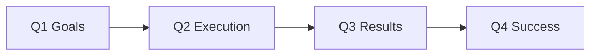

# Company Strategy {{year}}

  
    Innovation • Growth • Excellence
  

---

## Key Initiatives

::left::

### 🚀 Product Innovation
- New feature releases
- Technology upgrades
- User experience improvements

::right::

### 📈 Market Expansion
- Geographic growth
- New market segments
- Strategic partnerships

---

## Results & Metrics

---

## Thank You

Questions and Discussion

*Replace {{placeholders}} with your actual content*