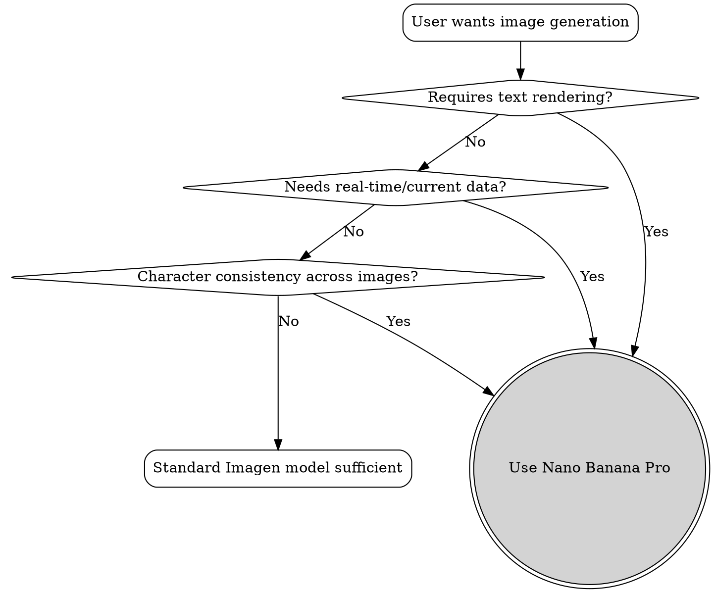

# Creating Images with Nano Banana Pro

## Overview

Nano Banana Pro is a reasoning-driven image generation model that "thinks" before rendering. Unlike prompt-keyword models, it evaluates physics logic, performs search grounding for real-time data, and supports iterative "Photoshop-style" edits via conversation.

**Core principle:** Act as creative director providing a detailed shot brief, not a keyword tagger.

## When to Use



**Use Nano Banana Pro when:**
- Image contains text that must be accurate (diagrams, charts, posters)
- Need real-time/factual data (news graphics, financial reports, weather cards)
- Character identity must persist across multiple images
- Need iterative refinement based on conversation
- Physics/logic accuracy matters (gravity, lighting, materials)

**Standard Imagen sufficient when:**
- Simple creative imagery without text
- No factual accuracy requirements
- One-off generation without iteration

## Six-Pillar Prompt Formula

Abandon keyword stacking ("cat, park, 4k"). Use natural language sentences in this order:

| Pillar | Description | Example |
|--------|-------------|---------|
| **Subject** | Must be specific | "一位穿着香奈儿套装的优雅老妇" not "一个女人" |
| **Action** | Describe dynamics | "摩托车手在半空中跳跃" triggers gravity calculation |
| **Setting** | Location + lighting | "巴西高端美食食谱的摆盘" triggers logical decoration |
| **Composition** | Cinema terminology | "低角度镜头", "深焦", "21:9 宽屏" |
| **Style** | Define clearly | "3D动画", "黑色电影", "1990年代产品摄影" |
| **Constraints** | Text content, font, position | See Typography section |

## Typography & Text Rendering

**Accuracy rules:**
- Under 15 characters: ~99% accuracy
- For guaranteed accuracy: keep total under **400 characters**
- Use quotation marks for literal text
- Specify font (serif/sans-serif) and weight (bold)

**Multilingual support:**
- Model can translate text in-image: "将罐头上的英文翻译成韩文"

## Search Grounding

When generating charts or graphics with real-world data, enable search grounding.

**Trigger words:** "latest", "today", "current", "2026", "now"

**Use cases:**
- Financial infographics with current stock data
- Weather cards with today's forecast
- News graphics about recent events
- Holiday calendar with current year dates

```bash
# Enable search with trigger words
imagen "搜索 2026 年中国的节假日安排，并生成一张现代风格的中文信息图表..."
```

## Identity Locking

Maintain consistent character appearance across scenes and edits.

**Capabilities:**
- Up to **14 reference images** (6 high-fidelity)
- Explicit instruction required: "保持面部特征与图片 1 完全一致"

**Sketch-to-render workflow:**
1. Upload hand-drawn sketch
2. Prompt: "严格遵循此草图的布局"
3. Model enforces layout while rendering

## CLI Quick Reference

```bash
# ❌ BAD: Keyword soup
imagen "cat, park, 4k, realistic"

# ✅ GOOD: Creative director brief
imagen "一张为巴西高端美食杂志拍摄的照片，主体是一个精心摆盘的巴西牛肉三明治，配有新鲜的香草装饰。采用电影感光影，浅景深（f/1.8），背景是模糊的现代化厨房。强调面包的焦脆纹理和芝士流动的光泽。" -r 4K -a 16:9

# Search grounding (trigger: "2026年")
imagen "搜索 2026 年中国的节假日安排，并生成一张现代风格的中文信息图表，包含详细的放假日期和 CEO 的寄语。" --verbose

# Identity locking with reference image
imagen "使用图片 1 作为角色参考。保持人物脸部特征完全一致，但将表情改为惊喜，并让他指向右侧的 3D 文字 '3分钟搞定'。" -i person.png
```

## Iterative Refinement

**Modify, don't regenerate:**

When result is 80% good, iterate conversationally:
- "很好，但请把灯光改为夕阳，并将文字改为蓝色"
- "根据流体动力学调整牛奶倾倒的角度"

Model understands physics and materials—use technical language for precise corrections.

## Common Mistakes

| Mistake | Fix |
|---------|-----|
| Keywords instead of sentences | Use natural language with full descriptions |
| No text constraints | Specify font, position, and exact content in quotes |
| Missing search triggers | Add "latest", "today", "current" for factual data |
| Generic subjects | Be specific: "穿香奈儿的老妇" not "女人" |
| Not using identity locks | Reference images + explicit "保持面部特征完全一致" |
| Regenerating from scratch | Use iterative conversation for 80%+ results |

## Mental Model

Think of yourself as directing a professional film crew. You provide the shot brief—story, lighting, materials—while Nano Banana Pro is the executor who can research real-time facts and understands physics laws.
