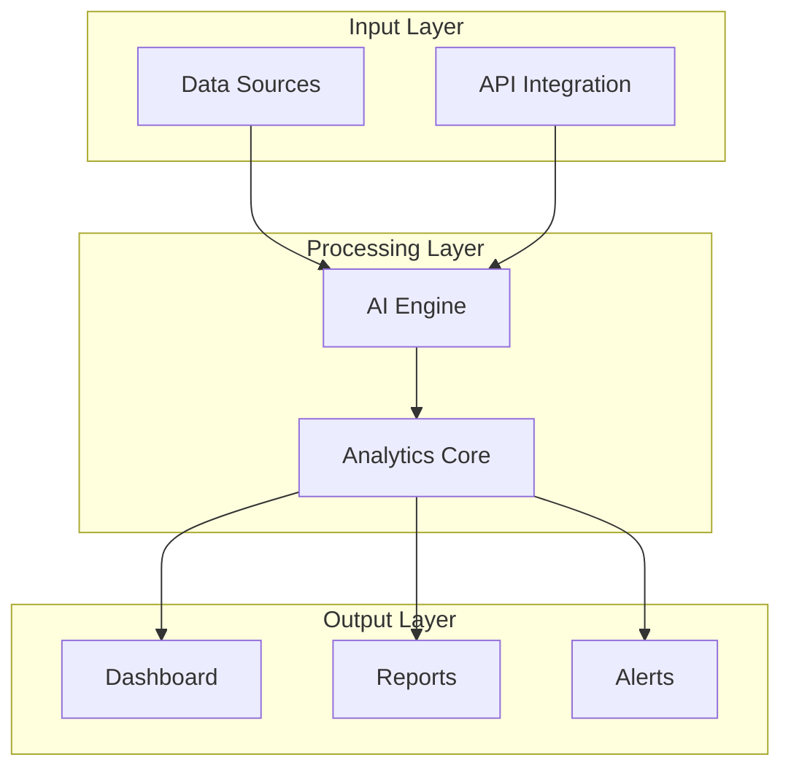
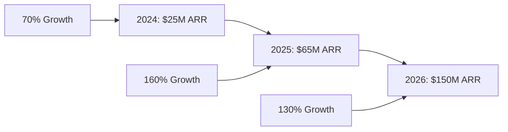

# Business Presentation Template

**Professional Corporate Presentation**

---

# Market Analysis

## Industry Overview

- Market size: **$10.5B** and growing 15% annually
- Key drivers: Digital transformation, automation demand
- Competitive landscape: Fragmented market with consolidation opportunities

<v-click>

## Target Market

### Primary Market
- Enterprise companies (500+ employees)
- Annual revenue > $50M
- Tech-savvy decision makers

### Secondary Market
- Mid-market companies (100-500 employees)
- Annual revenue $10M-$50M
- Growth-focused leadership

</v-click>

---
layout: two-cols
---

# Solution Overview

::left::

## Core Product Features

### 🎯 Intelligent Automation
- **90% reduction** in manual processing time
- **99.5% accuracy** rate
- 24/7 operation capability

### 📊 Real-time Analytics
- **Live dashboard** with key metrics
- **Predictive insights** for decision making
- **Custom reports** and export options

::right::

---

# Business Model

## Revenue Streams

### SaaS Subscription

70%

Monthly recurring revenue

### Enterprise Services

20%

Professional services

### Data Insights

10%

Advanced analytics

## Pricing Strategy

| Tier | Price | Target | Features |
|------|-------|--------|----------|
| Starter | $999/mo | Small teams | Core features, 5 users |
| Professional | $4,999/mo | Mid-market | Advanced features, 25 users |
| Enterprise | Custom | Large orgs | Full features, unlimited users |

---
layout: image-right
---

# Competitive Advantage

## Why Choose Us

### ✅ Technology Leadership
- **Patented AI algorithms**
- **Proprietary data processing**
- **Continuous innovation pipeline**

### ✅ Customer Success
- **95% customer retention**
- **4.8/5 customer satisfaction**
- **24/7 premium support**

### ✅ Market Position
- **First-mover advantage**
- **Strong IP portfolio**
- **Strategic partnerships**

### ✅ Financial Health
- **$25M ARR** and growing
- **72% gross margin**
- **Positive cash flow**

---

# Growth Strategy

## Market Expansion Plan

### Phase 1: Market Penetration (2024)
- **Geographic expansion**: 5 new markets
- **Product enhancement**: AI capabilities
- **Partnership development**: 10 strategic alliances

### Phase 2: Product Diversification (2025)
- **New product lines**: 2 additional solutions
- **Platform expansion**: API ecosystem
- **Vertical specialization**: 3 key industries

### Phase 3: Global Scale (2026+)
- **International presence**: 15+ countries
- **Market leadership**: #1 in segment
- **IPO preparation**: Public offering readiness

---
layout: center
---

# Investment Opportunity

## Funding Requirements

### Series B Round

$50M

### Use of Funds
- **Product Development**: 40%
- **Market Expansion**: 30%
- **Team Growth**: 20%
- **Working Capital**: 10%

### Expected ROI

3.5x

### Timeline
- **Breakeven**: Q4 2025
- **IPO ready**: 2027
- **Exit multiples**: 8-12x revenue

---

# Team Leadership

## Executive Team

### CEO - Jane Smith
- **15+ years** in SaaS leadership
- **Previous exits**: 2 successful companies
- **Expertise**: Business strategy, growth

### CTO - John Johnson
- **20+ years** in enterprise software
- **Former**: Google AI Director
- **Expertise**: AI/ML, scalable systems

### CFO - Sarah Williams
- **12+ years** in finance leadership
- **Previous**: Fortune 500 CFO
- **Expertise**: Financial strategy, IPOs

### CRO - Michael Brown
- **18+ years** in sales leadership
- **Track record**: $500M+ ARR generated
- **Expertise**: Enterprise sales, GTM

---

# Financial Projections

## 3-Year Outlook

## Key Metrics

| Metric | 2024 | 2025 | 2026 |
|--------|------|------|------|
| Revenue | $25M | $65M | $150M |
| Gross Margin | 72% | 75% | 78% |
| Customers | 500 | 1,200 | 2,500 |
| Net Revenue Retention | 115% | 120% | 125% |

---
layout: center
class: text-center
---

# Thank You

## Let's Build the Future Together

### Contact Information
- **Email**: investors@company.com
- **Phone**: +1 (555) 123-4567
- **Website**: www.company.com

### Next Steps
1. Due diligence process
2. Partner meetings
3. Term sheet negotiation
4. Closing and partnership

  <a href="https://github.com/slidevjs/slidev" target="_blank" alt="GitHub"
    class="text-xl slidev-icon-btn opacity-50 !border-none !hover:text-white">
    <carbon-logo-github />
  </a>
  <a href="https://sli.dev" target="_blank" alt="Slidev"
    class="text-xl slidev-icon-btn opacity-50 !border-none !hover:text-white">
    <carbon-logos-slidev />
  </a>

---

