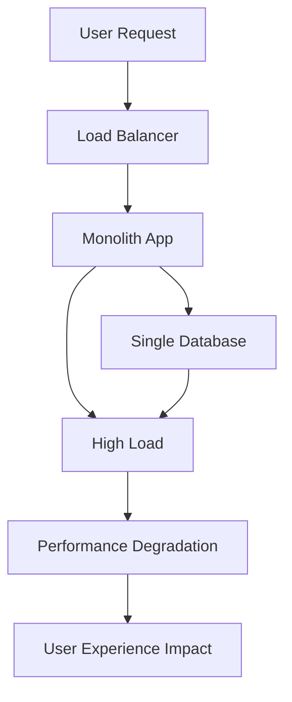
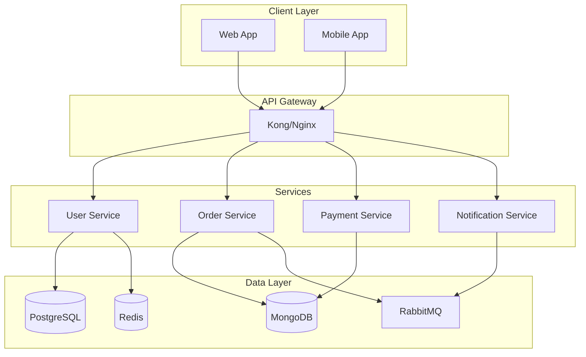
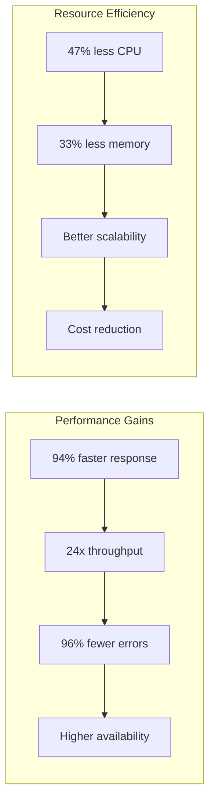

# Technical Presentation Template

**Advanced Technical Content Sharing**

---

# Problem Statement

## Current System Limitations

<div class="grid grid-cols-2 gap-4">

<div>

### 🔴 Performance Issues
- **Response time**: 2-3 seconds average
- **Throughput**: Limited to 1000 req/s
- **Resource utilization**: 85% CPU, 90% memory

</div>

<div>

### 🟡 Scalability Challenges
- **Monolithic architecture**: Hard to scale individual components
- **Database bottlenecks**: Single point of failure
- **Deployment complexity**: Full system restarts required

</div>

</div>

<div v-click>

## Root Cause Analysis



</div>

---
layout: two-cols
---

# Proposed Architecture

::left::

## Microservices Design

<div v-click>

### Core Principles
- **Single Responsibility**: Each service handles one business capability
- **Loose Coupling**: Services communicate via well-defined APIs
- **High Cohesion**: Related functionality grouped together
- **Bounded Context**: Clear service boundaries

</div>

<div v-click="2">

### Service Decomposition
```typescript
interface ServiceArchitecture {
  userService: {
    responsibilities: ['User management', 'Authentication', 'Profile'];
    database: 'PostgreSQL';
    cache: 'Redis';
  };

  orderService: {
    responsibilities: ['Order processing', 'Payment', 'Inventory'];
    database: 'MongoDB';
    messageQueue: 'RabbitMQ';
  };
}
```

</div>

::right::

<div v-click="3">



</div>

---

# Implementation Details

## Service Mesh Architecture

<div v-click>

```yaml
# Istio Service Mesh Configuration
apiVersion: networking.istio.io/v1beta1
kind: VirtualService
metadata:
  name: user-service
spec:
  hosts:
  - user-service
  http:
  - match:
    - uri:
        prefix: "/api/v1"
    route:
    - destination:
        host: user-service
        port:
          number: 8080
    timeout: 30s
    retries:
      attempts: 3
      perTryTimeout: 10s
```

</div>

<div v-click="2">

## Circuit Breaker Pattern

```typescript
class CircuitBreaker {
  private failureCount = 0;
  private failureThreshold = 5;
  private state: 'CLOSED' | 'OPEN' | 'HALF_OPEN' = 'CLOSED';

  async execute<T>(operation: () => Promise<T>): Promise<T> {
    if (this.state === 'OPEN') {
      throw new Error('Circuit breaker is OPEN');
    }

    try {
      const result = await operation();
      this.onSuccess();
      return result;
    } catch (error) {
      this.onFailure();
      throw error;
    }
  }

  private onSuccess() {
    this.failureCount = 0;
    if (this.state === 'HALF_OPEN') {
      this.state = 'CLOSED';
    }
  }

  private onFailure() {
    this.failureCount++;
    if (this.failureCount >= this.failureThreshold) {
      this.state = 'OPEN';
      setTimeout(() => {
        this.state = 'HALF_OPEN';
      }, 60000); // 1 minute timeout
    }
  }
}
```

</div>

---
layout: center
---

# Performance Optimization

## Database Query Optimization

<div v-click>

### Before Optimization
```sql
-- Slow query: 2.5 seconds
SELECT u.*, o.*, p.*
FROM users u
JOIN orders o ON u.id = o.user_id
JOIN payments p ON o.id = p.order_id
WHERE u.created_at > '2024-01-01'
  AND o.status = 'completed'
ORDER BY o.created_at DESC
LIMIT 100;
```

</div>

<div v-click="2">

### After Optimization
```sql
-- Optimized query: 0.15 seconds (16x faster)
WITH recent_users AS (
  SELECT id FROM users
  WHERE created_at > '2024-01-01'
),
user_orders AS (
  SELECT o.user_id, o.id, o.created_at, o.status
  FROM orders o
  JOIN recent_users ru ON o.user_id = ru.id
  WHERE o.status = 'completed'
  ORDER BY o.created_at DESC
  LIMIT 100
)
SELECT u.*, uo.*, p.*
FROM user_orders uo
JOIN users u ON uo.user_id = u.id
LEFT JOIN payments p ON uo.id = p.order_id
ORDER BY uo.created_at DESC;
```

</div>

<div v-click="3">

### Index Strategy
```sql
-- Optimal indexes for the query
CREATE INDEX idx_users_created_at ON users(created_at);
CREATE INDEX idx_orders_user_status_created ON orders(user_id, status, created_at DESC);
CREATE INDEX idx_payments_order_id ON payments(order_id);

-- Query plan now uses index scans instead of table scans
```

</div>

---
layout: two-cols
---

# Caching Strategy

::left::

## Multi-Level Caching

<div v-click>

### L1: Application Cache (Memory)
```typescript
class ApplicationCache {
  private cache = new Map<string, CacheEntry>();

  async get<T>(key: string): Promise<T | null> {
    const entry = this.cache.get(key);

    if (!entry || entry.expiresAt < Date.now()) {
      this.cache.delete(key);
      return null;
    }

    return entry.value as T;
  }

  async set<T>(key: string, value: T, ttlMs: number = 300000): Promise<void> {
    this.cache.set(key, {
      value,
      expiresAt: Date.now() + ttlMs
    });
  }
}
```

</div>

<div v-click="2">

### L2: Redis Cache (Distributed)
```typescript
class RedisCache {
  constructor(private redis: RedisClient) {}

  async get<T>(key: string): Promise<T | null> {
    const value = await this.redis.get(key);
    return value ? JSON.parse(value) : null;
  }

  async set<T>(key: string, value: T, ttlMs: number): Promise<void> {
    await this.redis.setex(key, ttlMs / 1000, JSON.stringify(value));
  }

  async invalidatePattern(pattern: string): Promise<void> {
    const keys = await this.redis.keys(pattern);
    if (keys.length > 0) {
      await this.redis.del(...keys);
    }
  }
}
```

</div>

::right::

<div v-click="3">

### Cache Implementation
```typescript
class CacheManager {
  constructor(
    private appCache: ApplicationCache,
    private redisCache: RedisCache
  ) {}

  async get<T>(key: string): Promise<T | null> {
    // Try L1 cache first (fastest)
    let value = await this.appCache.get<T>(key);
    if (value) return value;

    // Try L2 cache (fast)
    value = await this.redisCache.get<T>(key);
    if (value) {
      // Backfill L1 cache
      await this.appCache.set(key, value, 60000); // 1 minute
      return value;
    }

    // Cache miss
    return null;
  }

  async set<T>(key: string, value: T): Promise<void> {
    // Set both L1 and L2 caches
    await Promise.all([
      this.appCache.set(key, value, 60000),   // 1 minute L1
      this.redisCache.set(key, value, 3600000) // 1 hour L2
    ]);
  }
}
```

</div>

---

# Monitoring & Observability

## Distributed Tracing

<div v-click>

### OpenTelemetry Implementation
```typescript
import { trace, SpanKind, SpanStatusCode } from '@opentelemetry/api';

const tracer = trace.getTracer('user-service');

class UserService {
  async getUser(userId: string): Promise<User> {
    return tracer.startActiveSpan('user-service.getUser',
      { kind: SpanKind.SERVER, attributes: { 'user.id': userId } },
      async (span) => {
        try {
          // Database operation
          const user = await this.database.getUser(userId);

          span.setAttributes({
            'user.exists': !!user,
            'user.type': user?.type || 'unknown'
          });

          return user;
        } catch (error) {
          span.recordException(error);
          span.setStatus({
            code: SpanStatusCode.ERROR,
            message: error.message
          });
          throw error;
        }
      }
    );
  }
}
```

</div>

<div v-click="2">

### Metrics Collection
```typescript
import { Counter, Histogram, UpDownCounter } from '@opentelemetry/api';

class Metrics {
  private requestCounter: Counter;
  private responseTime: Histogram;
  private activeConnections: UpDownCounter;

  constructor(meter: Meter) {
    this.requestCounter = meter.createCounter('http_requests_total');
    this.responseTime = meter.createHistogram('http_response_time_ms');
    this.activeConnections = meter.createUpDownCounter('active_connections');
  }

  recordRequest(method: string, status: number, responseTime: number) {
    this.requestCounter.add(1, {
      'http.method': method,
      'http.status_code': status.toString()
    });

    this.responseTime.record(responseTime, {
      'http.method': method,
      'http.status_code': status.toString()
    });
  }

  incrementConnections() {
    this.activeConnections.add(1);
  }

  decrementConnections() {
    this.activeConnections.add(-1);
  }
}
```

</div>

---

# Security Implementation

## API Security

<div v-click>

### JWT Authentication with Refresh Tokens
```typescript
class AuthService {
  async authenticateUser(credentials: Credentials): Promise<Tokens> {
    const user = await this.validateCredentials(credentials);
    if (!user) throw new UnauthorizedError();

    const payload = {
      sub: user.id,
      email: user.email,
      role: user.role,
      iat: Math.floor(Date.now() / 1000),
      exp: Math.floor(Date.now() / 1000) + (15 * 60) // 15 minutes
    };

    const accessToken = jwt.sign(payload, this.config.jwtSecret);
    const refreshToken = this.generateRefreshToken(user.id);

    // Store refresh token hash
    await this.storeRefreshToken(user.id, refreshToken);

    return {
      accessToken,
      refreshToken,
      expiresIn: 900 // 15 minutes
    };
  }

  async refreshToken(refreshToken: string): Promise<string> {
    const tokenData = await this.validateRefreshToken(refreshToken);
    if (!tokenData) throw new UnauthorizedError();

    const user = await this.userService.findById(tokenData.userId);
    return this.generateAccessToken(user);
  }
}
```

</div>

<div v-click="2">

### Rate Limiting
```typescript
class RateLimiter {
  private requests = new Map<string, RequestLog[]>();

  async isAllowed(key: string, limit: number, windowMs: number): Promise<boolean> {
    const now = Date.now();
    const windowStart = now - windowMs;

    let requests = this.requests.get(key) || [];

    // Remove old requests outside the window
    requests = requests.filter(req => req.timestamp > windowStart);

    if (requests.length >= limit) {
      return false; // Rate limit exceeded
    }

    // Add current request
    requests.push({ timestamp: now });
    this.requests.set(key, requests);

    return true;
  }

  // Express middleware
  middleware(limit: number, windowMs: number) {
    return async (req: Request, res: Response, next: NextFunction) => {
      const key = this.getKey(req);
      const allowed = await this.isAllowed(key, limit, windowMs);

      if (!allowed) {
        return res.status(429).json({
          error: 'Too Many Requests',
          retryAfter: Math.ceil(windowMs / 1000)
        });
      }

      next();
    };
  }
}
```

</div>

---

# Deployment Strategy

## Kubernetes Configuration

<div v-click>

### Deployment Manifest
```yaml
apiVersion: apps/v1
kind: Deployment
metadata:
  name: user-service
  labels:
    app: user-service
    version: v1
spec:
  replicas: 3
  selector:
    matchLabels:
      app: user-service
  template:
    metadata:
      labels:
        app: user-service
        version: v1
    spec:
      containers:
      - name: user-service
        image: user-service:v1.2.0
        ports:
        - containerPort: 8080
        env:
        - name: DATABASE_URL
          valueFrom:
            secretKeyRef:
              name: db-credentials
              key: url
        - name: REDIS_URL
          valueFrom:
            configMapKeyRef:
              name: app-config
              key: redis-url
        resources:
          requests:
            memory: "256Mi"
            cpu: "250m"
          limits:
            memory: "512Mi"
            cpu: "500m"
        livenessProbe:
          httpGet:
            path: /health
            port: 8080
          initialDelaySeconds: 30
          periodSeconds: 10
        readinessProbe:
          httpGet:
            path: /ready
            port: 8080
          initialDelaySeconds: 5
          periodSeconds: 5
```

</div>

<div v-click="2">

### Service Mesh Configuration
```yaml
apiVersion: networking.istio.io/v1beta1
kind: Gateway
metadata:
  name: user-service-gateway
spec:
  selector:
    istio: ingressgateway
  servers:
  - port:
      number: 80
      name: http
      protocol: HTTP
    hosts:
    - user-service.example.com
---
apiVersion: networking.istio.io/v1beta1
kind: DestinationRule
metadata:
  name: user-service
spec:
  host: user-service
  trafficPolicy:
    loadBalancer:
      simple: LEAST_CONN
    connectionPool:
      tcp:
        maxConnections: 100
      http:
        http1MaxPendingRequests: 50
        maxRequestsPerConnection: 10
    circuitBreaker:
      consecutiveErrors: 3
      interval: 30s
      baseEjectionTime: 30s
```

</div>

---

# Performance Results

## Before vs After

<div v-click>

### Key Metrics Comparison

| Metric | Before | After | Improvement |
|--------|--------|-------|-------------|
| Response Time (p95) | 2.5s | 150ms | **94%** ⬇️ |
| Throughput | 1,000 req/s | 25,000 req/s | **2,400%** ⬆️ |
| CPU Utilization | 85% | 45% | **47%** ⬇️ |
| Memory Usage | 90% | 60% | **33%** ⬇️ |
| Error Rate | 2.5% | 0.1% | **96%** ⬇️ |
| Uptime | 99.5% | 99.95% | **0.45%** ⬆️ |

</div>

<div v-click="2">



</div>

---
layout: center
class: text-center
---

# Thank You

## Questions & Discussion

<div class="mt-8">

### Key Takeaways
1. **Microservices architecture** enables independent scaling and deployment
2. **Multi-level caching** dramatically improves performance
3. **Observability** is crucial for distributed systems
4. **Security** must be built-in, not bolted-on

### Resources
- **GitHub**: github.com/your-org/microservices-example
- **Documentation**: docs.your-project.com
- **Blog**: blog.your-project.com/migration-story

### Contact
- **Email**: tech-talk@your-project.com
- **Twitter**: @yourproject
- **LinkedIn**: linkedin.com/company/your-project

</div>

<div class="abs-br m-6 flex gap-2">
  <a href="https://github.com/slidevjs/slidev" target="_blank" alt="GitHub"
    class="text-xl slidev-icon-btn opacity-50 !border-none !hover:text-white">
    <carbon-logo-github />
  </a>
  <a href="https://sli.dev" target="_blank" alt="Slidev"
    class="text-xl slidev-icon-btn opacity-50 !border-none !hover:text-white">
    <carbon-logos-slidev />
  </a>
</div>

---

<style>
.slidev-layout {
  font-family: 'JetBrains Mono', 'Fira Code', monospace;
}

.code-block {
  background: #1e1e1e;
  border-radius: 8px;
  padding: 16px;
  font-size: 14px;
  line-height: 1.6;
  overflow-x: auto;
}

.tech-highlight {
  background: linear-gradient(135deg, #7c3aed 0%, #a855f7 100%);
  -webkit-background-clip: text;
  -webkit-text-fill-color: transparent;
  background-clip: text;
  font-weight: 600;
}

.metric-improvement {
  background: linear-gradient(135deg, #059669 0%, #10b981 100%);
  -webkit-background-clip: text;
  -webkit-text-fill-color: transparent;
  background-clip: text;
  font-weight: 700;
}
</style>