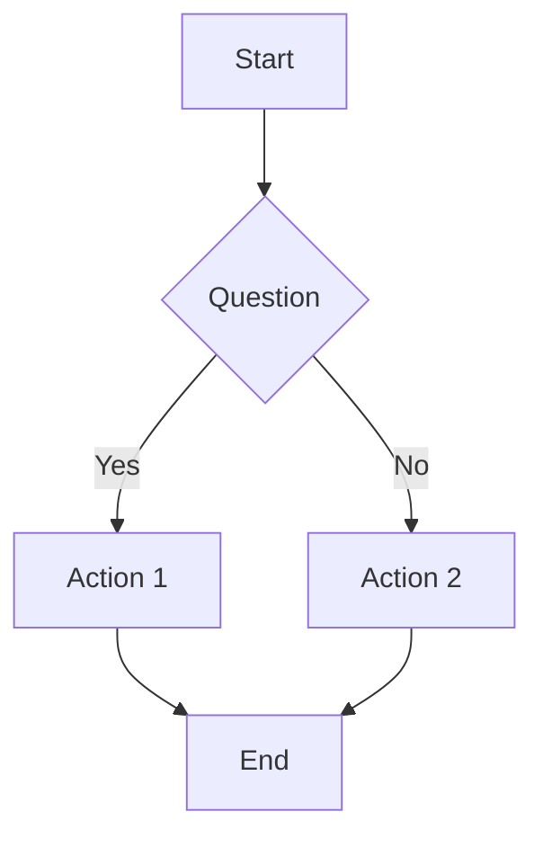
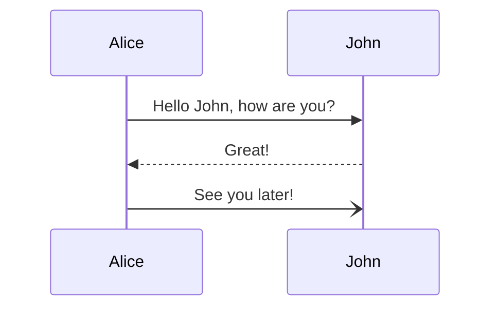

# Slidev Syntax Reference

## Frontmatter

Every Slidev presentation starts with YAML frontmatter:

```yaml
---
title: "Presentation Title"
author: "Author Name"
date: "2024-01-01"
theme: "default"
layout: "cover"
colorSchema: "auto"
highlighter: "shiki"
lineNumbers: false
info: |
  Presentation description
drawings:
  persist: false
transition: "slide-left"
mdc: true
---
```

## Slide Separators

Use `---` to separate slides:

```markdown
---
# Slide 1 Title

Content for slide 1

---

# Slide 2 Title

Content for slide 2
```

## Layouts

### Default Layout
```markdown
# Title

Content here
```

### Cover Layout
```markdown
---
layout: cover
---

# Main Title

## Subtitle

Author Name
```

### Section Layout
```markdown
---
layout: section
---

# Section Title

Section description
```

### Two Columns Layout
```markdown
---
layout: two-cols
---

# Title

::left::

Left column content

::right::

Right column content
```

### Center Layout
```markdown
---
layout: center
class: text-center
---

# Centered Title

Centered content
```

### Image Layouts
```markdown
---
layout: image-right
---

# Title

Content on the left


```

## Text Formatting

```markdown
# Heading 1
## Heading 2
### Heading 3

**Bold text**
*Italic text*
~~Strikethrough~~

`Inline code`

[Link text](https://example.com)
```

## Lists

```markdown
- Unordered item 1
- Unordered item 2
  - Nested item
  - Another nested item

1. Ordered item 1
2. Ordered item 2
```

## Code Blocks

```markdown
```javascript
// Code with syntax highlighting
function hello() {
  console.log("Hello Slidev!");
}
```

```text
// Plain text code block
```

## Vue Components

### Built-in Components
```markdown
<Tweet id="1390327149846298624" />

<YouTube id="QjVVDN32t2I" />

<Mermaid />
```

### Custom Components
```markdown
<MyComponent title="Hello" />

<div v-click>Click to reveal</div>

<div v-click="2">Reveal on second click</div>
```

## Animations and Transitions

### Click Animations
```markdown
<div v-click>Appears on first click</div>
<div v-click="2">Appears on second click</div>

<ul>
  <li v-click>Item 1</li>
  <li v-click>Item 2</li>
  <li v-click>Item 3</li>
</ul>
```

### Slide Transitions
In frontmatter:
```yaml
---
transition: "slide-left"
# or: "slide-up", "slide-right", "slide-down", "fade-out", "view-transition"
---
```

Per slide:
```markdown
---
transition: "fade-out"
---

# Slide with custom transition
```

## Mermaid Diagrams

```markdown




## KaTeX Math

```markdown
Inline math: $E = mc^2$

Block math:
$$
\int_{-\infty}^\infty e^{-x^2} dx = \sqrt{\pi}
$$
```

## Static Images

```markdown


```

## Layout Customization

### CSS Classes
```markdown
---
class: text-center
---

# Centered Title

All content is centered
```

### Inline Styles
```markdown
<div style="color: red;">

Red text content

</div>
```

### Custom CSS
```markdown
<style>
h1 {
  color: #ff6b6b;
}
</style>

# Styled Title
```

## Speaker Notes

```markdown
# Slide Content

<!--
Speaker notes here.
Only visible in presenter mode.
-->
```

## Monaco Editor

```markdown
---
layout: two-cols
---

::left::

# Live Coding

::right::

```monaco
// Live code editor
function hello() {
  console.log("Interactive coding!");
}
```

## Slidev-Specific Features

### TwoSlash
```typescript
function hello(name: string /** 👉 string */) {
  console.log(`Hello, ${name}!`)
  //                ^?
}
```

### Shiki Magic Move
```markdown
```md {*|1|2}
// Step 1
const message = "Hello"

// Step 2
const message = "Hello"
console.log(message)
```

## Advanced Features

### Dynamic Content
```markdown
{{ $slidev.nav.currentLayout }}
{{ $slidev.nav.currentSlideIndex }}
```

### Import Snippets
```markdown
<<< @/snippets/code.js
```

### Remote Data
```markdown
<!-- Fetch data from API -->
{{ await fetch('https://api.example.com/data') }}
```

## Export Formats

### PDF Export
```bash
npm run export
```

### PPTX Export
```bash
npm run export -- --format pptx
```

### Image Export
```bash
npm run export -- --format png
```

## Theme Customization

### Built-in Themes
- `default` - Default theme
- `seriph` - Serif font theme
- `shades-of-purple` - Purple theme
- `apple-basic` - Apple-inspired theme

### Custom Theme
```yaml
---
theme: "custom"
---

<style>
:root {
  --slidev-theme-primary: #5e8abf;
  --slidev-theme-secondary: #ff6b6b;
}
</style>
```

## Best Practices

1. **Keep slides simple** - One main idea per slide
2. **Use visual hierarchy** - Headings, lists, and emphasis
3. **Limit text** - Use visuals and code examples
4. **Test animations** - Ensure click sequences work properly
5. **Check exports** - Verify PDF and other formats look good

## Common Issues and Solutions

### Code Not Highlighting
Ensure language is specified after triple backticks.

### Images Not Loading
Place images in `public/` directory and reference with `/image-name.ext`.

### Animations Not Working
Check for proper `v-click` syntax and slide order.

### Export Issues
Ensure all dependencies are installed with `npm install`.